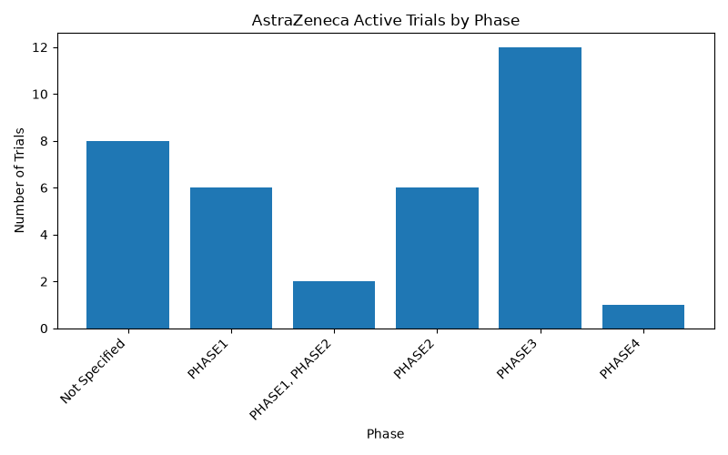

# AstraZeneca Clinical Trials Agent

A small AI agent that answers plain-English questions about AstraZeneca's public clinical trial data.



## Why

Trial status is public but scattered across dozens of individual records. This project pulls AstraZeneca's own trials into one place and lets someone ask a direct question — by phase, by timeline, by therapeutic area — instead of digging through records manually.

## What it answers

**1. How many active trials are in each phase right now?**
There are currently 35 active trials across phases, plus 8 trials with no phase specified. Of these: 6 are in Phase 1, 6 in Phase 2, 12 in Phase 3, 1 in Phase 4, and 2 span both Phase 1 and Phase 2.

**2. Which trials are past their expected completion date but not marked complete?**
Several trials have passed their expected completion date without being marked complete, under statuses such as "Unknown," "Withdrawn," or "Active, Not Recruiting." Examples include a Roflumilast Cream study in plaque psoriasis (expected September 2009, withdrawn) and the ORCHARD lung cancer platform study (expected May 2025, active but not recruiting).

**3. Which conditions/therapeutic areas have the most active trials?**
Ovarian cancer currently leads with two active studies. Several other areas — including urothelial cancer, multiple myeloma, and non-small cell lung cancer — each have one active trial.

## How it works

1. **Data pull** — trial data is pulled from the public [ClinicalTrials.gov API](https://clinicaltrials.gov/data-api/api), filtered to AstraZeneca as sponsor.
2. **Storage** — loaded into a local SQLite database (`az_trials.db`).
3. **Query layer** — three SQL queries answer the questions above directly.
4. **Agent** — a small AI agent (Google Gemini) takes a plain-English question, routes it to the right query, runs it, and explains the result in plain English — so no SQL knowledge is needed to use it.

## Tech stack

- Python
- `requests` — ClinicalTrials.gov API calls
- `pandas` — data handling
- SQLite — local storage
- `google-generativeai` — the agent layer (Gemini free tier)
- `matplotlib` — the chart

## Running it locally

```bash
# clone and enter the repo
git clone https://github.com/YOUR-USERNAME/az-trials-agent.git
cd az-trials-agent

# set up environment
python -m venv venv
source venv/Scripts/activate   # on Mac/Linux: source venv/bin/activate
pip install -r requirements.txt

# add your own free Gemini API key (get one at aistudio.google.com/apikey)
echo "GEMINI_API_KEY=your_key_here" > .env

# pull the data and build the database
python fetch_data.py
python load_db.py

# generate the chart
python chart.py

# run the agent
python agent.py
```

## What's next

With more time, this could connect to a live Power BI dashboard for continuous updates, or expand to a wider set of questions — e.g. enrollment trends, geographic distribution of trial sites, or comparisons against other sponsors.

---

*Built as a self-directed project to demonstrate the data + AI agent skills described in AstraZeneca's Data & AI Solutions Intern posting, using AstraZeneca's own public trial data.*